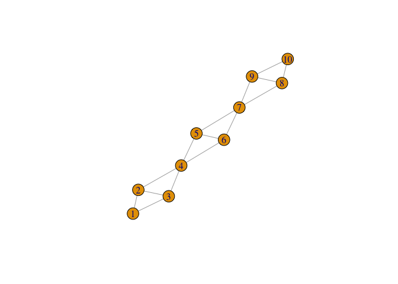

<!-- README.md is generated from README.Rmd. Please edit that file -->
<!-- badges: start -->

[](https://github.com/Ddey07/FGGMTools/actions/workflows/R-CMD-check.yaml)
<!-- badges: end -->

# FGGMTools: Graph-constrained Functional Principal Component Analysis for Multivariate Functional Data

The R package `FGGMTools` (a) Performs iterative proportional scaling
(IPS) to get graph-constrained MLE in Gaussian Graphical Models, (b)
Performs graph-constrained functional principal component analysis for
multivariate functional data. The methods are described in Dey,
Banerjee, Lindquist and Datta (2023)
<https://arxiv.org/pdf/2209.06294.pdf>.

The code uses slightly modified functions from the testing version of
copCS package available at
<https://github.com/donaldmusgrove/copCS/blob/master/R/ips.R> by
Dr. D.R. Musgrove and slightly modified functions **pfpca** and some
helper functions from the fgm package available at:
<https://github.com/javzapata/fgm> by Zapata, J., Oh, S., and Petersen,
A.

## Installation

``` install
devtools::install_github("DDey07/FGGMTools")
```

## Load libraries

``` r
library(igraph)
library(mvtnorm)
library(FGGMTools)
library(fda)
```

## Example: IPS

``` r

# Generate data y
p <- 10
Q <- qr.Q(qr(matrix(rnorm(p^2), p)))
Sigma <- crossprod(Q, Q*(5:1))
y = rmvnorm(1000, sigma=Sigma)
S = cov(y)
# Fix a graph, get the adjacency matrix. Here we pick path graph of length p
gg <- c(1,2,1,3,2,3,2,4,3,4)
x.1 <- gg
for(i in 1:2){
    x.1 <- x.1+rep(3,10)
    gg <- c(gg, x.1)
}
G_V <- make_graph(gg, directed=FALSE)
plot(G_V)
```

<!-- -->

``` r
A <- as.matrix(as_adjacency_matrix(G_V))
# Perform IPS
diag(A) = 1
K = IPS(S,A)
# Check for the non-edges if they equal to zero in precision matrix
all(K[A==0]==0)
#> [1] TRUE
# Check if the edge-specific entries are equal to that of S
max(abs(solve(K)[A==1]  - S[A==1]))
#> [1] 8.881784e-16
```

## Example: pfpca_covsel

``` r
## Variables
# Omega - list of precision matrices, one per eigenfunction
# Sigma - list of covariance matrices, one per eigenfunction
# theta - list of functional  principal component scores
# phi - list of eigenfunctions densely observed on a time grid
# y - list containing densely observed multivariate (p-dimensional) functional data

## Generate data y
 source(system.file("exec", "getOmegaSigma.R", package = "fgm"))
 theta = lapply(1:nbasis, function(b) t(rmvnorm(n = 100, sigma = Sigma[[b]])))
 theta.reshaped = lapply( 1:p, function(j){
     t(sapply(1:nbasis, function(i) theta[[i]][j,]))
 })
 phi.basis=create.fourier.basis(rangeval=c(0,1), nbasis=21, period=1)
 t = seq(0, 1, length.out = time.grid.length)
 chosen.basis = c(2, 3, 6, 7, 10, 11, 16, 17, 20, 21)
 phi = t(predict(phi.basis, t))[chosen.basis,]
 y = lapply(theta.reshaped, function(th) t(th)%*%phi)

# Fix a graph, get the adjacency matrix. Here we pick path graph of length p
gg <- c(1,2,1,3,2,3,2,4,3,4)
x.1 <- gg
for(i in 1:2){
    x.1 <- x.1+rep(3,10)
    gg <- c(gg, x.1)
}
G_V <- make_graph(gg, directed=FALSE)
A <- as.matrix(as_adjacency_matrix(G_V))
# Get graph-constrained estimate of covariance function for the process
pf_ips = pfpca_covsel(y,A=A,FVE=0.8)
```
